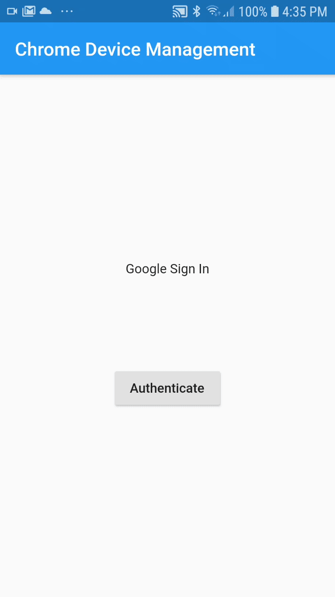

# Chrome Device Management App

## What is Chrome Device Management App?
Chrome Device Management App is aiming to help admins to complete urgent tasks that they usually need to perform in the admin console through a mobile app. The app allows them to see the information of their enrolled devices and perform remote commands such as deprovisioning and disabling on the device. 

Note that this is not an officially supported Google product.

### Google Sign In
CDM App uses [openID](https://developers.google.com/identity/protocols/oauth2/openid-connect) to a log in with a Google account. The app uses [flutter_web_auth](https://pub.dev/packages/flutter_web_auth) to authenticate the user.    
    

### List of Chrome Devices
In the list of devices the user can see the basic information of all the devices in the account by scrolling.   
   

### Filtering the list
In the list of Chrome Devices the user could filter the list to facilitate the search of specific devices.   
      

### Detailed Device
When a device is tapped, the app sends you to a new view where the user can see more information about the tapped device.   
     

### Remote Commands
In the detailed device view the user can do some remote actions to the device as disabling, enabling, and deprovisioning the device.    
   
